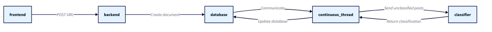
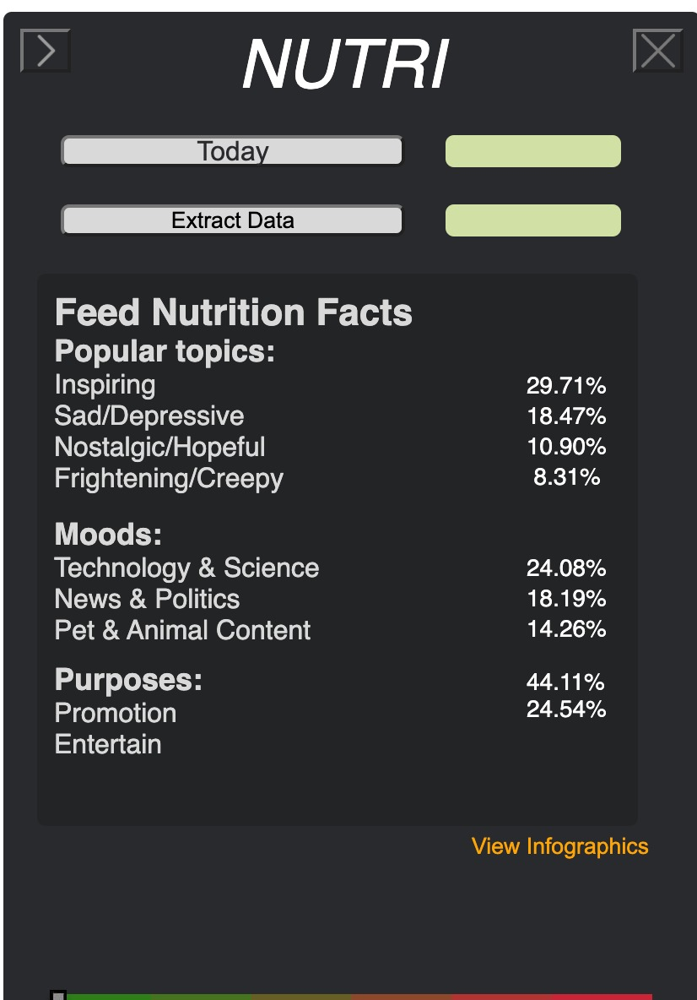
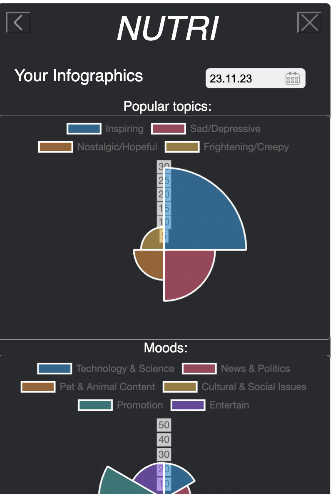

## Project title 
A Nutrition Label for Social Media Feeds
student project, winter term 2023, tim.gollub@uni-weimar.de

## Project Description
How healthy is your social media diet? In this project, we are developing a machine learning application that monitors a user's social media consumption. The questions we want to answer are: How much social media am I consuming? What are the ingredients and how are they distributed? Am I consuming mostly informative or entertaining content? What feelings are evoked by the posts? Are the political opinions expressed diverse or one-sided? Our application aims to enable users to better reflect on their social media usage habits and the content they consume,Beyond classification, our extension provides users with feedback on their overall social media consumption, assisting them in gaining deeper insights into their engagement patterns and the nature of content they interact with. Currently, this functionality is tailored specifically for Instagra. 

## Current Labels for Content Classification
Our project's classification system organizes posts into three main categories: **Popular Topics**, covering a wide range from Lifestyle & Entertainment to Travel & Exploration; **Moods**, capturing emotions from Joyful to Thoughtful; and **Purposes**, including Educate, Inspire, Entertain, and Promote. This ensures our content is diverse, engaging, and purposeful for our audience.

**Popular Topics:**

    1. Lifestyle & Entertainment
    2. News & Politics
    3. Travel & Exploration
    4. Health & Wellness
    5. Technology & Science
    6. Food & Cuisine
    7. Pet & Animal Content
    8. Nature & Photography
    9. Sports & Fitness
    10. Cultural & Social Issues

**Moods:**

    1. Joyful
    2. Sad/Depressive
    3. Peaceful
    4. Energetic/Excited
    5. Mysterious/Romantic
    6. Nostalgic/Hopeful
    7. Frightening/Creepy
    8. Inspiring
    9. Playful
    10. Thoughtful/Contemplative
    
**Purposes:**

    1. Educating
    2. Inspiring
    3. Entertaining
    4. Promoting

## Chrome Extention Design
The web extension design can be viewed here: [Web extension design](https://www.figma.com/file/Ygx4BJDZdcQEJTU337SGHh/Nutri-chrome-extension-layout?type=design&node-id=0%3A1&mode=design&t=XMv9HbDoQQ8E4boz-1)

## Research Paper
Our research paper can be viewed here: [Overleaf](https://www.overleaf.com/read/mvqpcmxcksht#36019d)

## Questionnaire about our working prototype
If you have downloaded and are using (have tried using) our prototype extension for Chrome, please take this survey: [Questionnaire](https://eu.jotform.com/form/240785853015358)
**Thank you a lot!**

## Technical Overview
The image shows a simplified architecture of the web extension workflow. It begins with  frontend interface sending data to the backend service using a POST request. The backend then creates a document in a database. A continuous thread communicates with the database to fetch a pending unclassified post and sends it to the classifier. The classifier processes the data and returns a classification result which is stored and updated in the database


## Installation

### Prerequisites

Before installing A Nutrition Label for Social Media Feeds, ensure you have the following prerequisites installed:

-  Python 3.8 or newer

### Installing A Nutrition Label for Social Media Feeds

Follow these steps to install project:

1. **Clone the repository**:
   
   ```bash
   git clone https://git.webis.de/code-teaching/projects/project-nutri-ws23.git
   
2. **Install requirements**:
   
    ```bash
   pip install -r requirements. txt

3. **Loading the Extension**

To load your Chrome extension, please follow these instructions. This process will enable you to install the extension in developer mode, allowing for testing and development without needing to publish it in the Chrome Web Store.

1. **Open the Chrome browser**: Start by opening Google Chrome on your computer.

2. **Access the Extensions Management Page**: You can do this by navigating to `chrome://extensions/` in your Chrome browser's address bar.

3. **Enable Developer Mode**: At the top right of the Extensions page, toggle the "Developer mode" switch to the ON position.

4. **Load the Extension Unpacked**:
    - Click the "Load unpacked" button that appears after you enable Developer Mode.
    - Navigate to the directory <path>\src\WebExtension\chrome.
    - Select the directory and click "Open" to install your extension in Chrome.

For a detailed step-by-step guide, including screenshots and additional tips, please visit the official Chrome Developers documentation: [Get Started with Chrome Extensions - Hello World](https://developer.chrome.com/docs/extensions/get-started/tutorial/hello-world#load-unpacked).

By following these steps, you should be able to load your Chrome extension and see it active in your browser. Remember to reload the extension from the Extensions Management page if you make any changes to the extension's files.

5. **Run server locally**:
   to run the server locally run the following command, the code runs by default on port 8000 
    ```bash
   uvicorn src.FastAPI.App.main:app --reload   


## Features
 The features provided by the WebExtension are as follows: <br> <br>
 **Nutrition facts** <br>
  The first feature shows the statistics about the user social media consumption and claculating the average for each label for all the posts 
<div align="center">
    
</div>

**Nutrition facts charts** <br>
  The second feature visualize the statistics as pie chart for better understanding of the number for each category
<div align="center">
    
</div>

## Demonstration 
The following link for show a quick YouTube demo for our WebExtension <br>
[Watch the Demo](https://youtu.be/0Bx1PvqDjCQ?si=9461ua4izhwtpla)

 
## Participants
- balint.toth@uni-weimar.de         baelint
- balkis.saidi@uni-weimar.de         balkissd_66559
- daria.zhukova@uni-weimar.De     cognizantdash
- ibtisam.arif@uni-weimar.de.       ibtisamarif831
- mohamed.salama@uni-weimar.de      mohamedsalama
